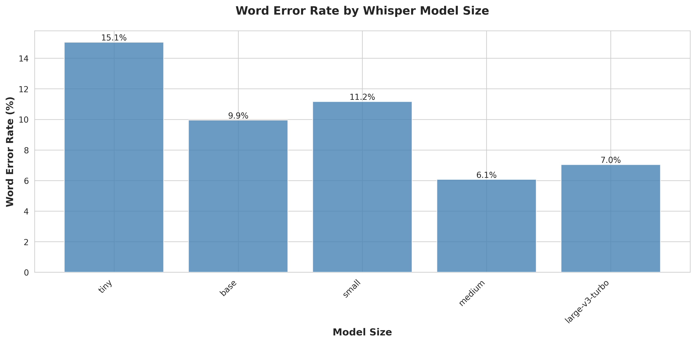
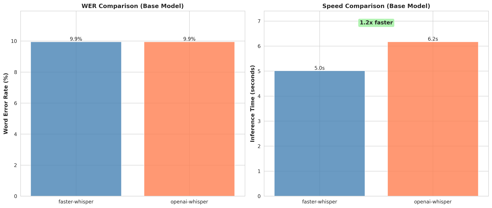
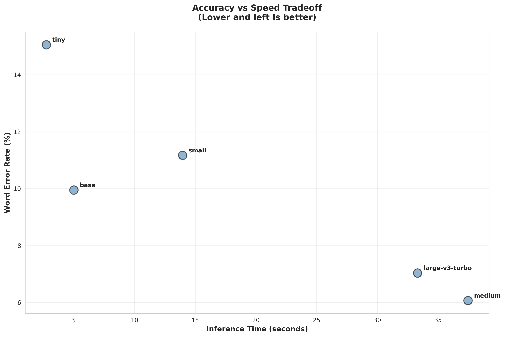
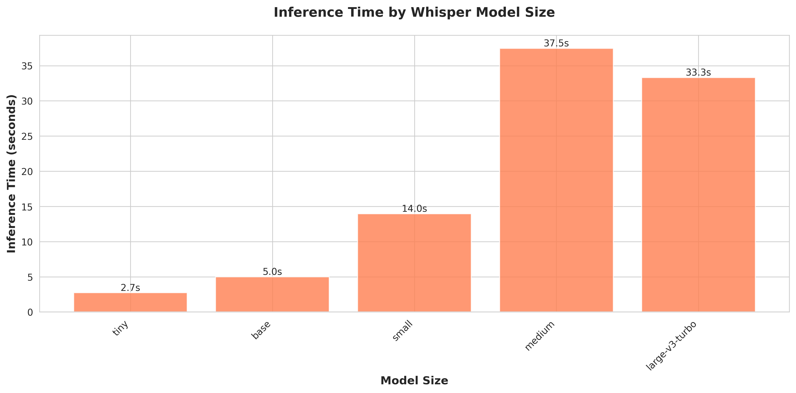
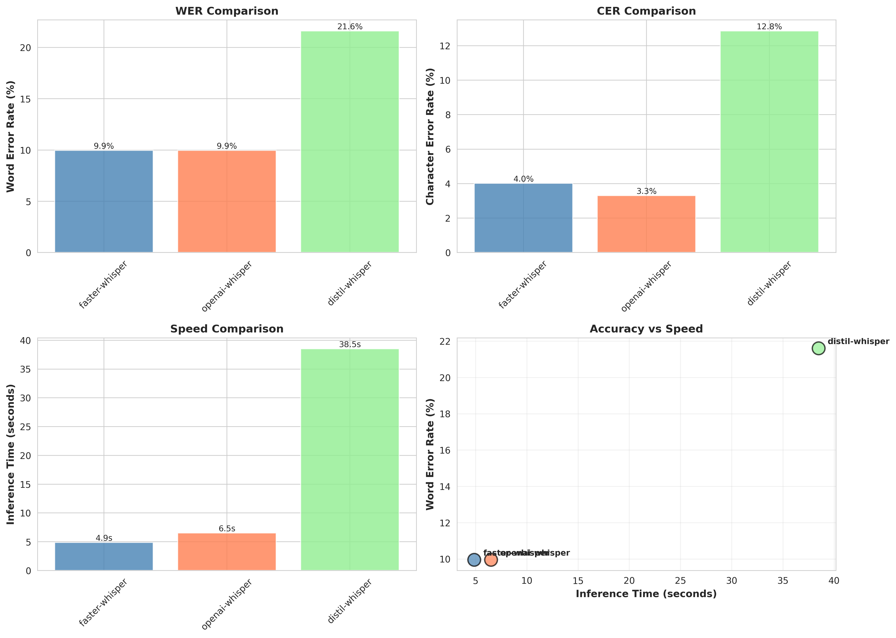

# Local ASR STT Benchmark

I was tired of guessing which Whisper model size to use for speech-to-text, so I ran a quick evaluation on my own setup to figure it out. Here's what I found.

**Important caveats:**
- This was tested on **one audio sample** of my voice
- Results are specific to **my hardware** (AMD Radeon RX 7700 XT, CPU-only inference)
- Your results will vary based on your voice, audio quality, hardware, and use case

That said, the patterns might still be useful as a rough guide.

---

## The Questions I Wanted to Answer

### Q1: How much does model size actually matter for accuracy?

**What I found:** It matters, but there are diminishing returns after small/medium.



On my test sample:
- **tiny**: 15.05% WER - Fast but rough
- **base**: 9.95% WER - Significant improvement
- **small**: 11.17% WER - Slight regression (interesting!)
- **medium**: 6.07% WER - Best accuracy in my test
- **large-v3-turbo**: 7.04% WER - Good balance

**My takeaway**: The biggest accuracy jump was from tiny → base. After that, diminishing returns for the speed cost.

---

### Q2: Is faster-whisper really as good as OpenAI Whisper?

**What I found:** On my test, yes - same accuracy, slightly faster.



Testing the same base model on my hardware:
- **faster-whisper**: 9.95% WER in 5.01s
- **openai-whisper**: 9.95% WER in 6.17s

**My takeaway**: Identical accuracy on this sample, faster-whisper was ~1.2x faster. Good enough reason for me to use it.

---

### Q3: What's the speed vs. accuracy tradeoff?

**What I found:** For my use case, base or small seems like the sweet spot.





On my hardware:
- **tiny**: Super fast (2.73s) but 15% WER is rough for my needs
- **base**: Good balance - 10% WER in 5s
- **small**: Similar to base, slightly slower
- **medium**: Best accuracy (6% WER) but 7x slower than tiny
- **large-v3-turbo**: 33s for 7% WER - more than I need

**My takeaway**: For daily transcription of my own voice, base or small hits the sweet spot for me.


---

### Q4: Which model should I use for my daily STT workflow?

**My personal answer:** base model with faster-whisper.

**Why it works for me:**
- ~10% WER is acceptable for my daily use (I dictate a lot)
- 5 seconds per clip is fast enough
- 140MB model size is manageable
- Good balance for my workflow

**When I'd use something else:**
- **tiny**: Quick tests or long recordings where speed matters more
- **medium/large**: Publishing/professional work where I need better accuracy

---

## All Variants Tested

I also threw distil-whisper into the mix to see if it lived up to the speed claims.



On my test:
- **faster-whisper**: 9.95% WER, 4.87s ✓
- **openai-whisper**: 9.95% WER, 6.51s
- **distil-whisper**: 21.6% WER, 38.49s ✗

**My takeaway**: distil-whisper was both slower AND less accurate on my sample. Unexpected, but that's what I got.

---

## Summary of My Results

- **Best accuracy** (on this sample): medium (6.07% WER)
- **Fastest**: tiny (2.73s)
- **My choice for daily use**: base (9.95% WER, 5s)
- **Recommended engine**: faster-whisper

---

## What's in This Repo

**Scripts** (in `scripts/`):
- `benchmark_stt.py` - Core benchmarking script
- `test_all_sizes.py` - Tests all Whisper sizes (tiny → large-v3)
- `compare_engines.py` - Compares faster-whisper vs openai-whisper
- `compare_fast_variants.py` - Compares different faster-whisper implementations
- `visualize_results.py` - Generates charts from benchmark results

**Results** (in `results/`):
- CSV files with WER, CER, and timing data from my tests
- Visualizations (PNG charts)
- Summary statistics

**Sample Data**:
- `audio/` - My test audio file
- `text/` - Reference transcription

**Documentation**:
- `answers.md` - Full analysis and methodology
- `setup.md` - How I set up my environment
- `models.md` - Info about the models tested
- `examples.md` - Usage examples if you want to run your own tests

---

## Running Your Own Tests

Want to benchmark on your own voice and hardware? Here's how:

1. Set up the conda environment (see `setup.md`)
2. Record your own audio samples and create reference transcriptions
3. Put audio in `audio/`, reference text in `text/`
4. Run the scripts:

```bash
# Test all model sizes
python scripts/test_all_sizes.py --audio audio/your_test.wav --reference text/your_test.txt

# Compare engines
python scripts/compare_engines.py --audio audio/your_test.wav --reference text/your_test.txt

# Generate visualizations from your results
python scripts/visualize_results.py
```

---

## Why I Made This

I use STT daily (I dictate most of my typing) and was flying blind when it came to model selection. Figured I'd run this evaluation once to get some clarity for myself.

Sharing it publicly in case the methodology or results are useful to someone else, but remember - this is **n=1 informal testing**, not rigorous research. Run your own tests to find what works for you.
 

## Hardware Context

My test environment:
- **GPU**: AMD Radeon RX 7700 XT (but using CPU inference)
- **CPU**: Intel Core i7-12700F
- **RAM**: 64 GB
- **OS**: Ubuntu 25.04

Your performance will differ based on your setup.

---

## Models Storage

Models get downloaded to `~/models/stt/` with subdirectories for different engines (openai-whisper, faster-whisper, etc).

## License

MIT - Use however you want. But seriously, test on your own audio before making decisions.
